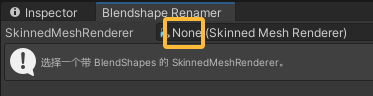
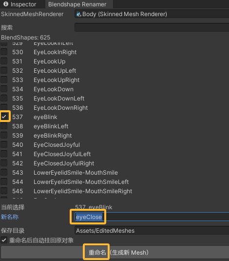

# 简易BlendShape改名工具 使用说明

一个极简的 Unity 编辑器工具，用来**把某个 BlendShape 改名**。  
特点：只改你选中的那一条；自动**复制出新 Mesh 资产**（不动原 FBX）；可选**自动替换到 SMR**。
在把vrc面捕的EyeClosed改为ARKit通用的eyeBlink时相当方便。

---

## 环境要求

- Unity **2019.4+**（更高版本亦可）
- 将脚本放在：`Assets/Editor/SimpleBlendshapeRenamerWindow.cs`
- 工程需**无编译错误**（Console 不能有红色报错）

---

## 如何打开

- 菜单：**Tools → Blendshape Simple Renamer**

---

## 快速上手

1. **选择 SMR**：在窗口顶端拖入你的 `SkinnedMeshRenderer`（该 Mesh 必须有 BlendShapes）。

2. **选一行**：在列表中勾选你要改名的那一条（可在“搜索”里输入关键字过滤）。
3. **填新名称**：在“新名称”输入框里写上目标名称。
4. **设置输出**：
   - **保存目录**（默认 `Assets/EditedMeshes`）
   - 勾选 **重命名后自动挂回 SMR** 可立即替换到模型上
5. 点击 **重命名（生成新 Mesh）**。完成后会弹窗提示新资产路径。

---

## 窗口区域说明

- **SkinnedMeshRenderer**：目标渲染器；更换后会自动刷新列表。
- **搜索**：实时过滤 BlendShape 名称。
- **列表**：显示 `Index` 与旧名称；勾选即选中该条（一次只改一条）。
- **当前选择 / 新名称**：显示所选条目，并输入新名字。
- **保存目录**：生成的新 `.asset` Mesh 存放位置；不存在会自动创建。
- **自动挂回**：完成后把新 Mesh 赋给该 SMR。

---

## 命名校验规则

- 新名称**不能为空**，且**不能与同一 Mesh 内其他 BlendShape 重名**。
- 工具只改**名称**，不改**索引**与**帧数据**；所有帧（顶点/法线/切线）保持不变。

> **ARKit 提示**：ARKit 使用**小驼峰**（如 `eyeBlinkLeft`）。本工具不会自动补齐缺失的左右形态，仅负责改名。

---

## 产物与回退

- 工具会复制出新 Mesh：`<原名>_Renamed.asset`，存放于“保存目录”。
- 若勾选“自动挂回”，SMR 会使用新 Mesh；未勾选则只生成文件。
- **回退**：在 SMR 的 **Mesh** 槽重新指定原始 Mesh（通常来自 FBX），或删除新 `.asset` 后重新指定。

---

## 常见问题（FAQ）

**Q：菜单看不到？**  
A：确认脚本在 `Assets/Editor/`；Console 无红错；不受 `asmdef` 限制（或为该文件夹创建 Editor 平台的 asmdef）；必要时执行 **Assets → Reimport All** 或重启 Unity。

**Q：按钮是灰的按不了？**  
A：需要先选中列表中的一条，并输入一个**有效且不重复**的新名称。

**Q：改名后动画没反应？**  
A：`AnimationClip` 绑定的是 `blendShape.<旧名>` 字符串。改名后旧曲线不会自动迁移，需要在 Clip 里改绑定名，或保留旧名版本。

**Q：会修改 FBX 吗？**  
A：不会。只会生成一个新的 Unity Mesh 资产，不影响 FBX 导入资源。

---

## 最佳实践

- 改名前先在版本控制做一次提交/备份。
- 要改多条时建议**逐条执行**；每次都会生成新 Mesh，勾选“自动挂回”能连贯操作。
- 做 ARKit 对接时，先检查 52 项清单；缺失的左右形态需要在 DCC 工具（Blender/Maya）里补权重，而不是仅靠改名。

---
